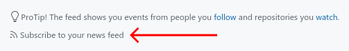

# github-feed-notifier 🔔

[](https://travis-ci.org/plibither8/gfn)
[](https://www.npmjs.com/package/gfn)
[](LICENSE)
[](https://www.npmjs.com/package/gfn?activeTab=dependencies)
[](https://madewithlove.org.in/)

[](https://www.npmjs.com/package/gfn)

> :octocat::bell: Cross-platform, native, desktop notification service for notifying when personal GitHub dashboard feed gets updated with new activity

## About

github-feed-notifier (GFN) is a small NodeJS program that produces desktop notifications when your GitHub dashboard feed is updated with a new item. The program uses [node-notifier](https://github.com/mikaelbr/node-notifier), which allows for cross-OS support (Linux, macOS and Windows).

### Why

There are [quite a few](https://github.com/search?q=github+notifier) "feed notifiers" for GitHub, but most of them lack something that I want:

* Cross-platform compatibilty
* Configurability
* Desktop notifications (and a not browser notification)
* Easy installation

## Usage

### Installation

#### Requirements

* [NodeJS](https://nodejs.org/en/download/) (and npm, of course)

Install GFN globally:

```sh
$ npm install -g gfn
```

and configure:

```sh
$ gfn config
```

Once properly configured, GFN can be run as a foreground process in your terminal: `$ gfn` or `$ github-feed-notifier`

### Configuration

The main requirement for configuration is your personal GitHub feed URL. You can obtain it by following these steps:

1. Login to GitHub and go to your dashboard (the [homepage](https://github.com))
2. Scroll down entirely, to the bottom of the feed (do not click the 'Load more' button)
3. Click on the "Subscribe to your news feed" link



4. Copy the URL of this link. This is your personal feed URL
5. Run `gfn config` and paste this link

### Run as a Background Process

Though GFN can be run directly as shown above, it is meant to be run as a **background process** on your computer to prevent using an extra terminal session.

To start GFN as a background process, use [forever](https://github.com/foreverjs/forever), a simple CLI tool that allows a script to run _forever_, in the background.

To get started, install 'forever' globally:

```sh
$ npm install -g forever
```

Once installed, start forever:

```sh
$ forever start `npm root -g`/gfn
```

### Start Automatically on System Startup

This is where it gets different for different platforms, OS's and builds. I recommend looking it up for your own platform.

One possible, cross-platform solution is to use [pm2](https://github.com/Unitech/pm2) instead of 'forever' to run the command forever, as pm2 lets you keep your process alive after every restart using [startup hooks](https://github.com/Unitech/pm2#startup-hooks-generation). But for a small project like this, pm2 might be overkill.

To get started, answers to questions on StackExchange worked for me, for [Linux](https://stackoverflow.com/questions/12973777/how-to-run-a-shell-script-at-startup) and [macOS](https://superuser.com/questions/229773/run-command-on-startup-login-mac-os-x).

---

## License

Copyright (c) Mihir Chaturvedi. All rights reserved.

Licensed under the [MIT](LICENSE) License.